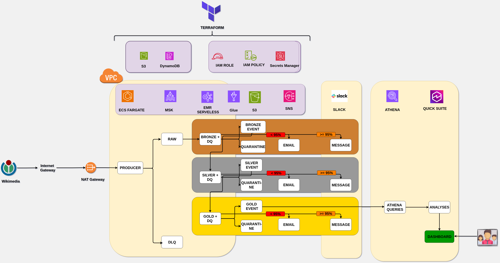

# WikiGuard - Real-time Wikimedia Vandalism Detection Pipeline
[](https://aws.amazon.com/msk/)
[](https://aws.amazon.com/ecs/)
[](https://aws.amazon.com/emr/serverless/)
[](https://aws.amazon.com/s3/)
[](https://iceberg.apache.org/)
[](https://aws.amazon.com/athena/)
[](https://aws.amazon.com/quicksight/)
[](https://spark.apache.org/)

A production-grade streaming data pipeline that monitors Wikimedia edit events in real-time, detects potential vandalism patterns, and generates actionable metrics using AWS-native services and the Medallion Architecture.

## 📚 Documentation

| Document | Purpose |
|----------|---------|
| **This README** | Overview, architecture, quick start |
| [docs/RUNBOOK.md](docs/RUNBOOK.md) | **Operations guide**: deploy, restart, replay, backfill, troubleshooting |
| [docs/ARCHITECTURE.md](docs/ARCHITECTURE.md) | **Architecture details**: design, components, data flow |
| [infrastructure/terraform/README.md](infrastructure/terraform/README.md) | Terraform module details and configuration |

## 📋 Table of Contents

- [Architecture](#architecture)
- [Features](#features)
- [Technology Stack](#technology-stack)
- [Project Structure](#project-structure)
- [Data Flow](#data-flow)
- [Quick Start](#quick-start)
- [Infrastructure Deployment](#infrastructure-deployment)
- [Running the Pipeline](#running-the-pipeline)
- [Data Quality](#data-quality)
- [Monitoring](#monitoring)
- [Local Development](#local-development)
- [Known Behavior](#known-behavior)
- [Cost Estimation](#cost-estimation)

---

## Architecture

The pipeline ingests real-time edit events from **Wikimedia EventStreams** (SSE API) through an **ECS Fargate** container that filters events by a configurable entity allowlist and produces them to **Amazon MSK** (Kafka). Three **EMR Serverless** Spark Structured Streaming applications process data through a Medallion Architecture: **Bronze** (2-min micro-batches) writes raw JSON to Iceberg, **Silver** (10-min) parses, deduplicates, and enriches events with quality validation, and **Gold** (10-min) computes aggregated metrics per entity/user with anomaly detection. Each layer applies data quality gates (PyDeequ + SQL checks) that route passed records to main tables and failed records to quarantine tables, with alerts sent via SNS/Slack. Data is stored in **S3** as Apache Iceberg tables, registered in **AWS Glue Data Catalog**, and queryable through **Amazon Athena** and **QuickSight** dashboards.



## Features

### Data Pipeline
- **Real-time ingestion** from Wikimedia EventStreams (SSE)
- **Entity filtering** via configurable allowlist (track specific Wikimedia pages)
- **Medallion Architecture** (Bronze → Silver → Gold) with Apache Iceberg
- **Streaming micro-batches** with configurable latency targets

### Data Quality
- **Multi-layer quality gates** with SQL-based validation
- **PyDeequ integration** for data quality checks
- **Quarantine tables** for failed records (no data loss)
- **Automated alerting** via SNS and Slack

### Analytics
- **Per-entity metrics**: Edit frequency, revert rates, user diversity
- **Per-user metrics**: Activity patterns, anonymous vs registered behavior
- **Global metrics**: Platform health indicators, anomaly detection
- **Time-windowed aggregations** (10-minute windows)

---

## Technology Stack

| Component | Technology | Purpose |
|-----------|------------|---------|
| **Ingestion** | ECS Fargate, Python SSE Client | Consume wikimedia events |
| **Streaming** | Amazon MSK (Kafka) | Event buffering & decoupling |
| **Processing** | EMR Serverless (Spark 3.5) | Structured Streaming |
| **Storage** | S3 + Apache Iceberg | ACID lakehouse tables |
| **Catalog** | AWS Glue Data Catalog | Schema management |
| **Analytics** | Amazon Athena | SQL queries on Iceberg |
| **Visualization** | Amazon QuickSight | Dashboards |
| **IaC** | Terraform | Infrastructure as Code |
| **Alerting** | SNS + Slack | Data quality notifications |

---

## Project Structure

```
wikiguard/
├── config/
│   └── entity-allowlist.yaml      # wikimedia pages to monitor
├── infrastructure/
│   ├── docker/ingest/             # Local testing environment (Docker)
│   └── terraform/                 # AWS infrastructure (IaC)
│       ├── modules/
│       │   ├── ecs/               # Fargate ingest service
│       │   ├── msk/               # Managed Kafka
│       │   ├── emr-serverless/    # Spark processing
│       │   ├── s3/                # Lakehouse storage
│       │   ├── glue/              # Data catalog
│       │   ├── athena/            # Query engine
│       │   ├── vpc/               # Networking
│       │   ├── iam/               # Permissions
│       │   └── sns/               # Alerting
│       └── main.tf                # Root module
├── scripts/
│   ├── processing/                # EMR job submission scripts
│   │   ├── serverless_submit_bronze.sh
│   │   ├── serverless_submit_silver.sh
│   │   ├── serverless_submit_gold.sh
│   │   └── serverless_monitor.sh
│   ├── start_pipeline.sh          # Start all services
│   └── stop_pipeline.sh           # Stop all services
└── src/
    ├── ingest/
    │   └── sse_consumer.py        # Wikimedia SSE → Kafka producer
    └── processing/
        ├── bronze_writer.py       # Kafka → Bronze Iceberg
        ├── silver_writer.py       # Bronze → Silver (cleaned)
        ├── gold_writer.py         # Silver → Gold (aggregated)
        └── data_quality.py        # Quality gates & alerting
```

---

## Data Flow

### Medallion Architecture

| Layer | Trigger | Purpose | Output |
|-------|---------|---------|--------|
| **Bronze** | 2 min | Raw JSON ingestion from Kafka | `bronze_events` (Iceberg) |
| **Silver** | 10 min | Parse, dedupe, validate, enrich | `silver_events` (Iceberg) |
| **Gold** | 10 min | Aggregate metrics per entity/user/global | `gold_*_metrics_10min` (Iceberg) |

### Quality Gates

Each layer has a quality gate that validates records before writing:

```
┌────────────┐     ┌─────────────────┐     ┌────────────────────────┐
│ Input Batch│────▶│  Quality Gate   │────▶│ Passed → Main Table    │
│            │     │ (SQL / PyDeequ) │     │ Failed → Quarantine    │
└────────────┘     └─────────────────┘     └────────────────────────┘
```

**Quality Dimensions:**
- **Completeness**: Required fields must be non-null
- **Freshness**: Events must arrive within 1 hour (`processing_lag <= 3600s`)
- **Size**: Each batch must contain at least 1 record
- **Validity**: Data types, value ranges, allowed values
- **Temporal**: Timestamps must be reasonable (after 2022, not in future)

---

## Quick Start

### Prerequisites

- AWS CLI configured with appropriate permissions
- Terraform >= 1.5.0
- Docker installed (for building ingest image)
- Access to EMR Serverless, ECS, MSK, and S3

### 1. Deploy Infrastructure

```bash
cd infrastructure/terraform

# First time: bootstrap state backend
cd bootstrap && terraform init && terraform apply && cd ..

# Configure variables
cp terraform.tfvars.example terraform.tfvars
# Edit terraform.tfvars with your values

# Deploy
terraform init
terraform apply -auto-approve
```

### 2. Build and Push Docker Image

```bash
# Build ECS Fargate ingest image and push to ECR
cd scripts/ingest
./build_and_push_docker.sh
```

> **Note**: This step is required before starting ECS for the first time, or when updating the SSE consumer code.

### 3. Start the Pipeline

```bash
# Start ECS ingest service
aws ecs update-service --cluster wikiguard-cluster \
  --service wikiguard-ingest-service --desired-count 1

# Submit EMR Serverless jobs
cd scripts/processing/
./serverless_submit_bronze.sh
./serverless_submit_silver.sh
./serverless_submit_gold.sh
```

Or use the convenience scripts:

```bash
./scripts/start_pipeline.sh   # Start everything
./scripts/stop_pipeline.sh    # Stop everything
```

### 4. Stop the Pipeline

```bash
# Stop ECS ingest
aws ecs update-service --cluster wikiguard-cluster \
  --service wikiguard-ingest-service --desired-count 0

# Cancel EMR jobs
./scripts/processing/serverless_cancel_all.sh
```

---

## Infrastructure Deployment

See [infrastructure/terraform/README.md](infrastructure/terraform/README.md) for detailed deployment instructions.

---

## Running the Pipeline

### Expected Processing Latency

| Layer | Target SLA |
|-------|------------|
| Bronze | ~ 2 min | 
| Silver | ~ 10 min | 
| Gold | ~ 10 min | 

### Monitor Job Status

```bash
# Check all EMR jobs
./scripts/processing/serverless_monitor.sh

# Check ECS service
aws ecs describe-services --cluster wikiguard-cluster \
  --services wikiguard-ingest-service \
  --query 'services[0].{desired:desiredCount,running:runningCount}'
```

### View Logs

```bash
# Bronze logs
aws s3 cp s3://<bucket>/emr-serverless-logs/bronze/applications/<app-id>/jobs/<job-id>/SPARK_DRIVER/stdout.gz - | gunzip

# Silver/Gold logs (same pattern)
```

### Alerts

Data quality failures trigger alerts via:
- **SNS**: Email notifications for CRITICAL issues
- **Slack**: Channel notifications (#data-quality) for WARNING/CRITICAL

---

## Monitoring

### CloudWatch Metrics

- EMR Serverless job duration, success/failure
- ECS task count, CPU/memory utilization
- MSK consumer lag

---

## Local Development

### Docker-based Testing Environment

For local development and testing, a Docker environment is available that simulates the ingestion step:

```
infrastructure/docker/ingest/
├── docker-compose.yml         # Kafka, Zookeeper, Kafka UI
├── Dockerfile                 # SSE consumer image
└── kafka-connect/             # S3 Sink connector
```

This environment includes:
- Local Kafka broker
- `simple_sse_consumer.py` - Simplified SSE consumer for testing
- Kafka Connect with S3 Sink

**Note**: This is for **testing only**. The official solution uses ECS Fargate + MSK.

```bash
cd infrastructure/docker/ingest
docker compose up -d
```

See [infrastructure/docker/ingest/README.md](infrastructure/docker/ingest/README.md) for details.

---

## Known Behavior

### Stale Events After Pipeline Restart

If you stop ECS Fargate for hours/days but keep MSK running:

1. Bronze reads **all past records** from Kafka topic on restart
2. Silver's quality gate **fails stale events** (freshness check: `processing_lag > 3600s`)
3. Stale records go to **quarantine**, not the main Silver table

**This is expected** - the pipeline protects against processing outdated data.

### Silver Job Performance

If Silver exceeds 10 minutes:
- Reduce entities in `config/entity-allowlist.yaml`
- Use SQL instead of  PyDeequ by setting (`skip_pydeequ=True`)

---

## Cost Estimation

Estimated costs for running the complete pipeline **24/7 for 1 week** (us-east-1 pricing, February 2026).

### Weekly Cost Breakdown

| Service | Configuration | Hourly | Weekly (168 hrs) |
|---------|---------------|--------|------------------|
| **ECS Fargate** | 1 task (0.25 vCPU, 0.5 GB) | $0.012 | **$2.00** |
| **Amazon MSK** | 2× kafka.t3.small brokers | $0.091 | **$15.30** |
| **MSK Storage** | ~10 GB (7-day retention) | - | **$0.25** |
| **EMR Serverless** | Bronze (4 vCPU, 8 GB) continuous | $0.26 | **$43.00** |
| **EMR Serverless** | Silver (6 vCPU, 16 GB) ~60% util | $0.24 | **$41.00** |
| **EMR Serverless** | Gold (6 vCPU, 16 GB) ~60% util | $0.24 | **$41.00** |
| **S3 Storage** | ~50 GB Iceberg tables | - | **$1.15** |
| **S3 Requests** | ~500K PUT/week | - | **$2.50** |
| **NAT Gateway** | 1 gateway + 10 GB data | $0.05 | **$8.00** |
| **CloudWatch** | Logs + Metrics | - | **$2.00** |
| **Glue Catalog** | Metadata (free tier) | - | **$0.00** |
| **Athena** | ~10 GB scanned/week | - | **$0.05** |
| | | | |
| **TOTAL** | | | **~$156/week** |

### Cost Drivers

| Component | % of Total | Notes |
|-----------|------------|-------|
| EMR Serverless | **80%** | Largest cost - consider reducing executor size |
| MSK | **10%** | Fixed cost - runs 24/7 regardless of usage |
| NAT Gateway | **5%** | Consider VPC endpoints for S3 to reduce |
| Other | **5%** | S3, ECS, CloudWatch |

### Cost Optimization Tips

1. **EMR Serverless**: Reduce executor memory/cores if processing is fast enough
2. **MSK**: Use MSK Serverless for variable workloads (pay per data)
3. **NAT Gateway**: Add S3 VPC endpoint to eliminate NAT charges for S3 traffic
4. **Business Hours**: Stop ECS + EMR outside working hours to save ~70%
5. **Spot Instances**: Not available for EMR Serverless, but consider EMR on EC2 with Spot

### Free Tier Eligible

- **S3**: 5 GB storage, 20K GET, 2K PUT requests/month
- **Glue Data Catalog**: 1 million objects stored
- **CloudWatch**: 10 custom metrics, 5 GB logs ingested

> **Note**: Prices are estimates based on AWS us-east-1 pricing. Actual costs may vary based on data volume, query patterns, and AWS pricing changes.

---

## License

MIT License - See [LICENSE](LICENSE) for details.
