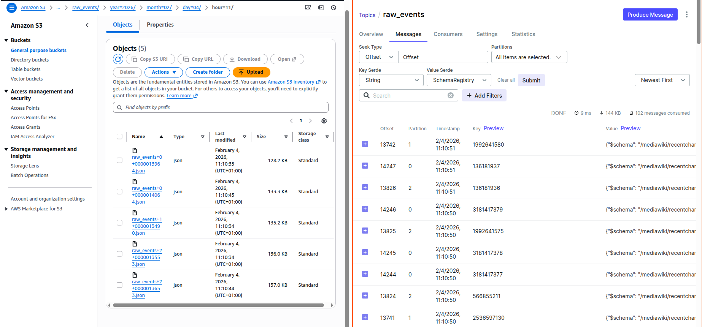

# WikiGuard Local Development Environment

> ⚠️ **Local Testing Only** - This Docker setup is for development and testing. For production deployment, see the main [README.md](../../../README.md) and [docs/RUNBOOK.md](../../../docs/RUNBOOK.md).

Docker Compose environment for running the ingestion pipeline locally: Wikimedia SSE → Kafka → S3.

## Architecture

```
┌─────────────────────────┐
│ Wikimedia EventStreams  │ (SSE - Server-Sent Events)
  │
└───────────┬─────────────┘
            │
            ▼
┌─────────────────────────┐
│   Ingestion Service     │ (Docker container)
│   simple_sse_consumer   │
└───────────┬─────────────┘
            │
            ▼
┌─────────────────────────┐
│     Kafka Broker        │ 
│   Topic: raw_events     │
└───────────┬─────────────┘
            │
            ▼
┌─────────────────────────┐
│   Kafka Connect         │
│   S3 Sink Connector     │
└───────────┬─────────────┘
            │
            ▼
┌─────────────────────────┐
│      AWS S3             │
│  bronze/raw_events/     │
│  year=YYYY/month=MM/... │
└─────────────────────────┘
```

## Prerequisites

### 1. Docker & Docker Compose
```bash
docker --version    # Docker 20.10+ (Current Docker 29.1.5)
docker compose version  # Compose v2+ (Current Docker Compose version v5.0.1)
```

### 2. AWS CLI Configuration
Configure AWS CLI with your credentials (this is the recommended approach for GitHub repositories):

```bash
# Install AWS CLI if not installed
curl "https://awscli.amazonaws.com/awscli-exe-linux-x86_64.zip" -o "awscliv2.zip"
unzip awscliv2.zip
sudo ./aws/install

# Configure AWS credentials
aws configure
# Enter your:
# - AWS Access Key ID
# - AWS Secret Access Key  
# - Default region (e.g., us-east-1)
# - Default output format (json)
```

### 3. Export AWS Credentials Before Running Docker Compose
After configuring AWS CLI, export the credentials as environment variables:

```bash
# Export credentials from AWS CLI config
export AWS_ACCESS_KEY_ID=$(aws configure get aws_access_key_id)
export AWS_SECRET_ACCESS_KEY=$(aws configure get aws_secret_access_key)
export AWS_REGION=$(aws configure get region)
```

### 3. S3 Bucket
Create the bucket:
```bash
aws s3 mb s3://wikiguard-lakehouse-dev --region us-east-1
```

### 4. Available Ports
- `8080` - Kafka UI
- `8081` - Schema Registry  
- `8083` - Kafka Connect
- `9092` - Kafka Broker

## Quick Start

### Step 1: Navigate to Directory
```bash
cd infrastructure/docker/ingest
```

### Step 2: Build and Start All Services
```bash
docker compose up -d --build
```

### Step 3: Verify Services are Running
```bash
docker compose ps
```

Expected output:
```
NAME                      STATUS
wikiguard-kafka           healthy
wikiguard-schema-registry healthy
wikiguard-kafka-connect   healthy
wikiguard-ingestion       running
wikiguard-kafka-ui        running
```

### Step 4: Watch Ingestion Logs
```bash
docker compose logs -f ingestion
```

You should see:


### Step 5: Deploy S3 Sink Connectors
```bash
cd kafka-connect
./deploy-connectors.sh
```

### Step 6: Verify Data Flow

**Kafka UI** (http://localhost:8080):
- Topics → `raw_events` → Messages tab
- Check message count is increasing

**S3 Console** or CLI:
```bash
aws s3 ls s3://wikiguard-lakehouse-dev/bronze/raw_events/ --recursive
```
## Result
you should see files being written to S3 in the `bronze/raw_events/` prefix.


## Services Overview

| Service | URL/Port | Purpose |
|---------|----------|---------|
| Kafka Broker | localhost:9092 | Message broker |
| Schema Registry | http://localhost:8081 | Schema management |
| Kafka Connect | http://localhost:8083 | S3 sink connectors |
| Kafka UI | http://localhost:8080 | Monitoring dashboard |
| Ingestion | (internal) | SSE → Kafka producer |

## Kafka Topic

| Topic | Purpose | S3 Destination |
|-------|---------|----------------|
| `raw_events` | Raw Wikimedia events | `bronze/raw_events/` |

## Configuration

### Environment Variables (docker-compose.yml)

| Variable | Default | Description |
|----------|---------|-------------|
| `KAFKA_BOOTSTRAP_SERVERS` | broker:29092 | Kafka connection |
| `AWS_ACCESS_KEY_ID` | - | AWS credentials |
| `AWS_SECRET_ACCESS_KEY` | - | AWS credentials |
| `AWS_REGION` | us-east-1 | AWS region |

## Troubleshooting

### No Events in Kafka
```bash
# Check ingestion service
docker compose logs ingestion

# Restart ingestion
docker compose restart ingestion
```

### No Data in S3
```bash
# Check connector status
curl http://localhost:8083/connectors/s3-sink-raw-events/status | jq

# Check connector logs
docker compose logs connect | grep -i error

# Redeploy connectors
cd kafka-connect && ./deploy-connectors.sh
```

### Check Topic Messages
```bash
docker exec wikiguard-kafka kafka-console-consumer \
  --bootstrap-server localhost:9092 \
  --topic raw_events \
  --from-beginning \
  --max-messages 5
```

### Reset Everything
```bash
docker compose down -v
docker compose up -d --build
```

## Stopping the Environment

```bash
# Stop services
docker compose down

# Stop and remove volumes (clean slate)
docker compose down -v
```

## What Happens Next (AWS)

After successful local testing, the production pipeline runs on AWS:

1. **ECS Fargate**: Runs the ingestion container
2. **Amazon MSK**: Managed Kafka cluster
3. **S3**: Data lake storage (bronze/silver/gold layers)
4. **EMR Serverless**: Spark processing jobs
5. **Glue/Athena**: Query and catalog

See `../terraform/` for AWS infrastructure deployment.
